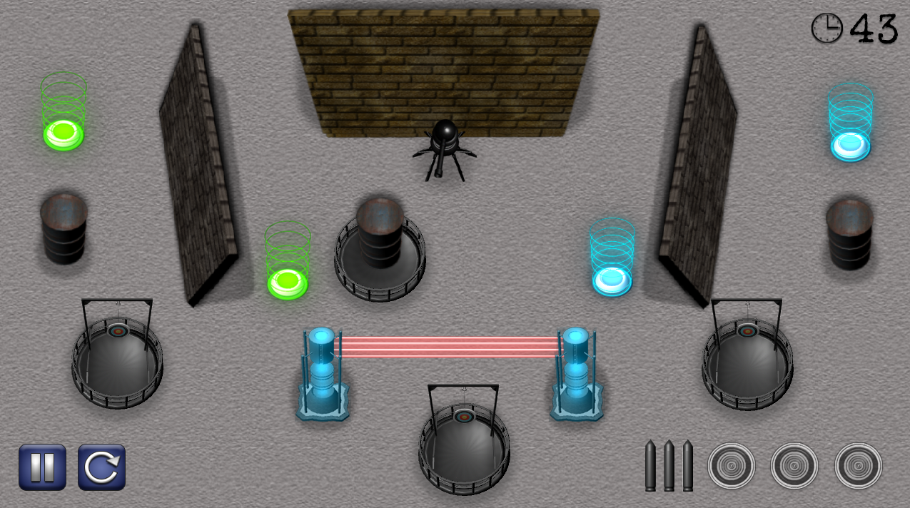
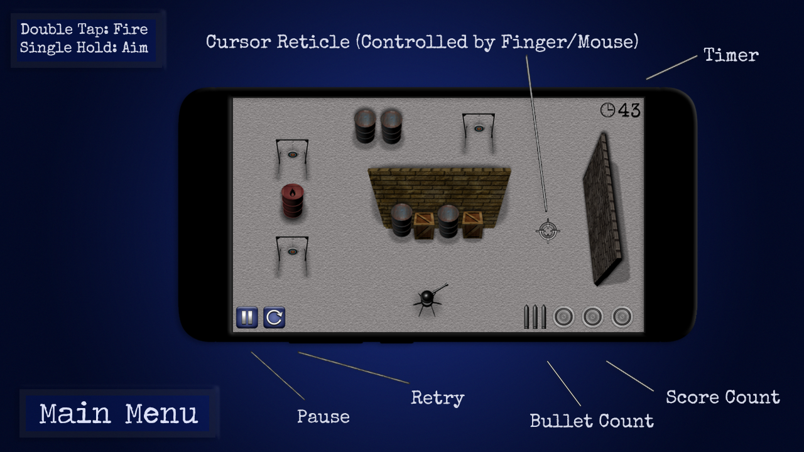

# 🎯 Turret the Targets

  

**Turret the Targets** is a 42-level arcade-style target shooting game originally created in **2018 as a student project** using Clickteam Fusion.

The player controls a turret and must destroy all targets before time runs out, while carefully managing limited ammunition and using the environment to their advantage.

## 🎮 Gameplay

Each level challenges the player to eliminate all targets within a limited amount of time.

### Features

- 🎯 Target shooting
- ⏱️ Time-limited levels
- 🔫 Limited ammunition
- 💥 Explosive barrels
- 🧱 Non-reflective obstacles
- ↩️ Reflective walls and bullet ricochets
- 📦 Crates and non-explosive barrels
- 🏆 42 levels

Some levels require more than simply shooting directly at a target. Players may need to use explosive barrels or bounce bullets off reflective walls to reach targets.

## 🕹️ Controls

### Android

- **Single touch / hold:** Aim
- **Double tap:** Fire

### Windows

- **Mouse:** Aim
- **Double click:** Fire

The Windows version adapts the original touch-based gameplay for mouse input.

## 📖 How to Play

The game includes an in-game tutorial explaining the different objects and mechanics.

  

The player starts each level with three bullets and must use them carefully.

Targets change appearance when successfully hit, allowing the player to track their progress.

## 🎮 Controls

  

## 📸 Gameplay

  

## 💻 Platforms

- Android
- Windows

## 🛠️ Development

**Engine:** Clickteam Fusion

Originally developed in **2018 as a student project**, Turret the Targets was created as an exploration of game development, programming, level design and interactive media.

The project includes work in:

- Game logic and programming
- Level design
- User interface design
- Touch and mouse controls
- Collision and object interactions
- Timers and ammunition systems
- Target progression
- Android deployment
- Windows deployment
- Custom game assets and presentation

## 📦 Windows Download

A playable Windows build is available through the repository's **Releases** section.

**[Download the latest Windows release](../../releases/latest)**

## 👤 About

Turret the Targets is a completed student game project that has been revisited and prepared for Windows and Android release.

The project represents an early exploration into game development using Clickteam Fusion and remains part of my development portfolio.
